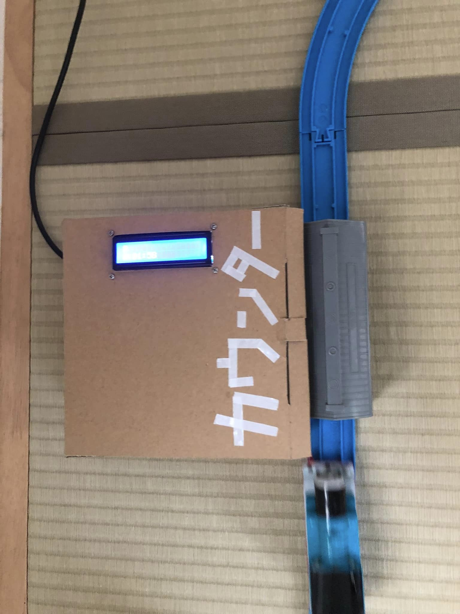
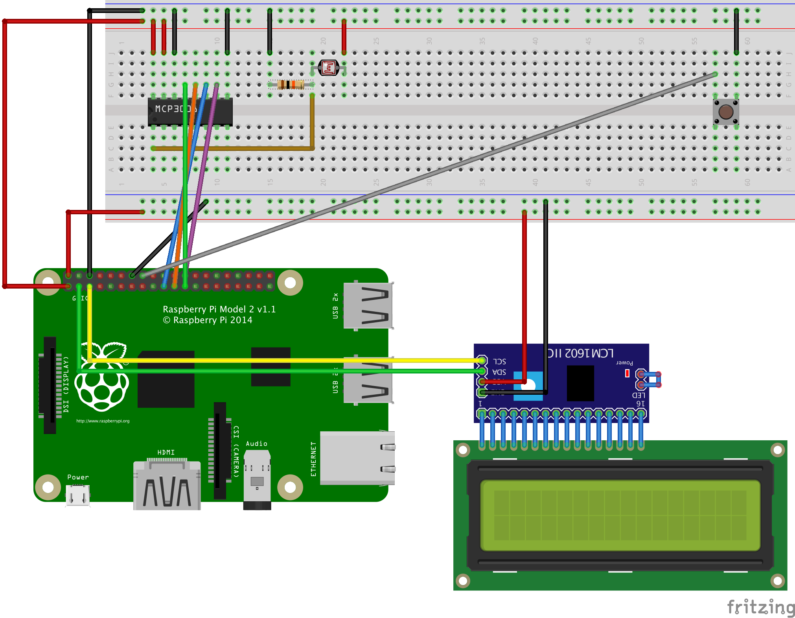

# Plarail Counter
A raspberry pi counter with photo-resistor and LCD display.
A photo-resistor light sensor captures a train as it passes by and count up.

## How to run
### enable i2c
Refer https://osoyoo.com/2016/06/01/drive-i2c-lcd-screen-with-raspberry-pi/
- enable i2c using raspi-config utility
- install smbus and i2c python library
- testing hardware
- download python library

### run 
pipenv install
pipenv run start

## Reference Implementation
### Hardwares

- Raspberry Pi 2 Model B
- I2C 1602 Serial LCD Module
- GL5516 Photo-Resistor
- MCP3008-I/P AD Converter
- Push Button
- Resistor 10kΩ

### circuit diagram

